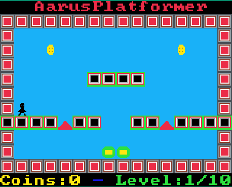

<h1 align="center">🎮 AarusPlatformer</h1>

<p align="center">
  AarusPlatformer is a 2D platformer game built using the 
  <a href="https://github.com/hackclub/sprig/">Sprig Game Engine</a> and JavaScript.  
  Players navigate through levels, collect coins, and avoid spikes.
</p>

<p align="center">
  
</p>

---

## ✨ Features

- 🕹️ Classic platformer gameplay: run, jump, collect coins, avoid spikes, and reach the goal.  
- 🎨 Custom sprites and levels.  
- ⚙️ Built on the Sprig engine for easy web and hardware deployment.  

---

## 🚀 Getting Started

### 📦 Prerequisites
- Node.js (for engine development)  
- A modern web browser (for playing the game)  

### ▶️ Play the Game
Open `games/AarusPlatformer.js` in the Sprig web editor or use the Sprig engine to run locally.  

### 🖥️ Run Locally
1. Clone this repository.  
2. Install dependencies for the engine:  
   ```bash
   cd engine
   npm install
   ```
3. Open the game file in your preferred environment.  

---

## 📂 Project Structure

- `games/AarusPlatformer.js` — Main game code.  
- `engine/` — Sprig engine source and TypeScript types.  
- `firmware/` — Hardware-related code for Sprig devices.  
- `README.md` — Project documentation.  

---

## 🙌 Credits

- 🎮 Game by Aarav Gupta  
- ⚡ Sprig Engine by Hack Club  

---

## 📜 License

Licensed under the Apache License, Version 2.0 (the "License");  
you may not use this file except in compliance with the License.  
You may obtain a copy of the License at:

http://www.apache.org/licenses/LICENSE-2.0  

Unless required by applicable law or agreed to in writing, software  
distributed under the License is distributed on an "AS IS" BASIS,  
WITHOUT WARRANTIES OR CONDITIONS OF ANY KIND, either express or implied.  
See the License for the specific language governing permissions and  
limitations under the License.
